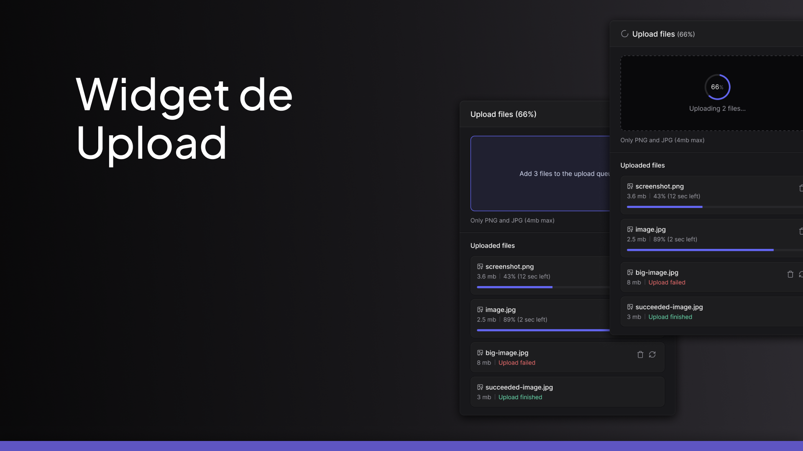
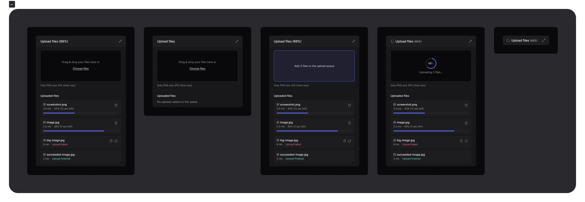

# Upload Widget

Um componente moderno e elegante para upload de arquivos, projetado para oferecer uma experiência de usuário fluida e responsiva.



## 📋 Visão Geral

O Upload Widget é uma solução completa para gerenciamento de uploads de arquivos, com suporte para uploads múltiplos, visualização de progresso em tempo real e gerenciamento da fila de uploads.



## ✨ Funcionalidades

- **Arrastar e soltar** (Drag and drop) de arquivos
- **Seleção de múltiplos arquivos** através do navegador de arquivos
- **Indicadores de progresso** em tempo real durante o upload
- **Visualização da fila** de arquivos para upload
- **Restrições de tipo de arquivo** (PNG e JPG) e tamanho máximo (4MB)
- **Status visual** para uploads concluídos e falhos
- **Interface responsiva** e adaptável a diferentes tamanhos de tela
- **Design moderno** com tema escuro

## 🛠️ Tecnologias

### Frontend

- [React 19](https://react.dev/) - Biblioteca para construção de interfaces
- [TypeScript](https://www.typescriptlang.org/) - Tipagem estática
- [Vite](https://vitejs.dev/) - Build tool e servidor de desenvolvimento
- [TailwindCSS](https://tailwindcss.com/) - Framework CSS utilitário
- [React Dropzone](https://react-dropzone.js.org/) - Componente para upload de arquivos
- [Zustand](https://zustand-demo.pmnd.rs/) - Gerenciamento de estado
- [Radix UI](https://www.radix-ui.com/) - Componentes de UI acessíveis
- [Lucide React](https://lucide.dev/docs/lucide-react) - Biblioteca de ícones
- [Axios](https://axios-http.com/) - Cliente HTTP para requisições

### Backend

- [Node.js](https://nodejs.org/) - Ambiente de execução JavaScript server-side
- [Fastify](https://fastify.io/) - Framework web rápido e de baixa sobrecarga
- [TypeScript](https://www.typescriptlang.org/) - Tipagem estática
- [Drizzle ORM](https://orm.drizzle.team/) - ORM SQL moderno para TypeScript
- [AWS S3](https://aws.amazon.com/s3/) - Armazenamento de objetos na nuvem
- [PostgreSQL](https://www.postgresql.org/) - Banco de dados relacional
- [Zod](https://zod.dev/) - Validação de esquemas
- [Docker](https://www.docker.com/) - Containerização da aplicação

## 🚀 Como Executar

### Pré-requisitos

- Node.js 18+
- Yarn
- Docker e Docker Compose (para o backend)

### Frontend

```bash
# Navegar para o diretório do frontend
cd frontend

# Instalar dependências
yarn install

# Iniciar servidor de desenvolvimento
yarn dev
```

### Backend

```bash
# Navegar para o diretório do backend
cd backend

# Copiar arquivo de variáveis de ambiente
cp .env.example .env

# Iniciar containers Docker
docker-compose up -d

# Instalar dependências
yarn install

# Executar migrações do banco de dados
yarn db:migrate

# Iniciar servidor de desenvolvimento
yarn dev
```
